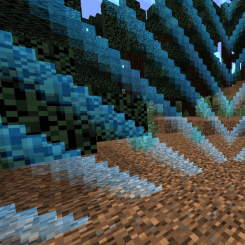

## WorldBorder Info ~
Prevent players from passing a certain point in your server worlds!
 
Stops glitchers trying to get past the border locking them in an uncomfortable position!
 
 

## Features
- Options to teleport player to spawn + send messages
- Fling knockback at WorldBorder
- Administrator bypass options + permission for bypass
- Multi-world support
- Option for visual picture like icon

## Common Questions ~
**Q** : Can I teleport the player to spawn if they pass the border?
 
**A** : Yes, this is optional in the configuration!
 
 
**Q** : Can I setup multiple worlds with different border sizes?
 
**A** : Yes you can in the configuration. Under `border:`, create a new line using the following format: `worldName: borderSize`. ex. `lobby: 300`.
 
 
**Q**: Can I bypass the WorldBorder on my server?
 
**A**: Yes there is a permission you can set for players, and operators have this by default. You can manage this permission under `plugin.yml`.

## Basic Plugin Setup ~
- Download the plugin zip or phar
- Upload to folder "plugins" on your PocketMine-MP server
- Restart the server
- Set your desired world and world size under the "plugin_data" folder and restart / reload your server

## Reporting Bugs
To report a bug, open an issue on the Github:
 
https://github.com/Hydros01/WorldBorder/issues
